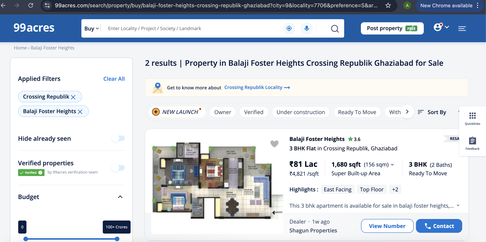

<h1>99 acres Web Scrapper</h1>

---

## Features:

This project enables to scrape

- Any **City** real-estate data
- Any **Locality** real-estate data
- Any **particular society or apartments** data.
- **Pagination** fully supported.
- **Filters** can be applied like how many bathrooms, maxPrice, minPrice etc.
- This app can be used to extract all **list pages** of 99acres like this.
  &nbsp;
  &nbsp;
  

---

## Working Screenshots

- ##### Society

&nbsp;

---

- ##### City & locality

&nbsp;

&nbsp;

---

&nbsp;

---

## Demo

Demo Csv files has been added with this repository named as

- **South Delhi_99acres.csv**
- **Noida_99acres.csv**
- **Griha Pravesh_99acres.csv**

 **Expires at 26 Sep 24**

---

## How to Use?

#### For Society-wise search

- Just **enter required society name** in **main.py** file.
- After that the script will scrape all listed buildings on website related to that society.

- A csv file will be stored in same filepath with name starting with that society.
- **Pagination** is fully supported.

#### For City and Locality wise search

- Enter **city** and **locality** in the script.py file.
- Then it will fetch all data related to that city and locality.
- **Pagination is fully supported** but I have applied a pagelimit of 20 pages which can be changed easily.

- A csv file will be stored in same filepath with name starting with locality or city .

---

### Technologies and libraries Used:

- Python3
- Selenium + chromedriver
- Beautifulsoup4
- Pandas

---

#### Copyright and Ownership:

- 🚨 **All csv content belongs to 99acres.com and it is only for educational and learning purposes** 🚨.

- ⚠️It should not be used for commercial purposes.⚠️

---

#### Note:

This website is completely dynamic and server-side rendered so you may get staleElementException.(Element has been modified/changed after we have selected it in our code) or NoSuchElementException Just try again it will work.

---

#### Upcoming features:

- Society Specifications and details page:
  &nbsp;
  > As of now I have not added script to scrape details kind of page. Soon will add that.

&nbsp;

&nbsp;

- Website UI & UX

  > Until now, I have been working on backend part soon I will also add an User interface to this.
  > &nbsp;

- Logging:
  > Will add logging in entire project so that it will be easy to debug any potential errors.

---
